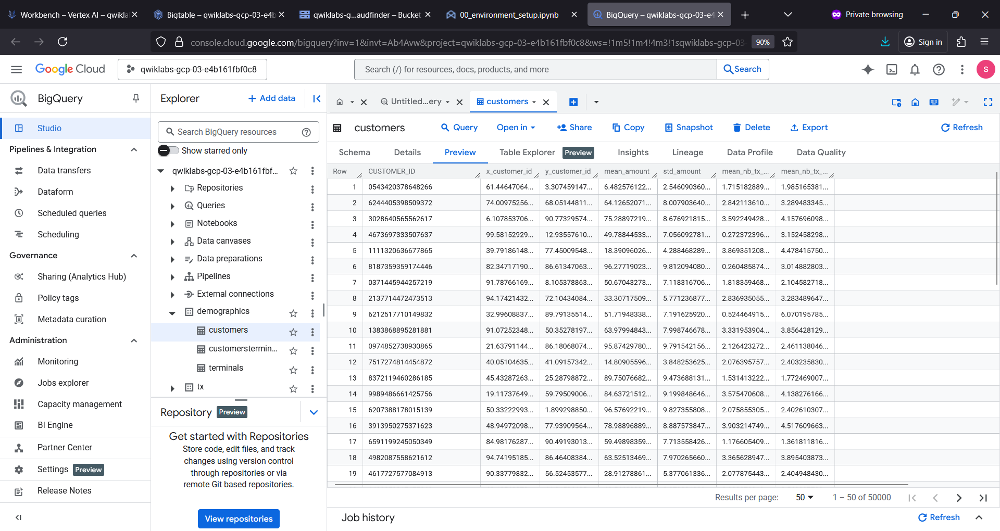

# fraudfinder
fraudfinder : Historical Payment Transactions # Fraud Detection # EDA # Feature Store # Model Registry

## Objective
- To read historical payment transactions data stored in a data warehouse
- Read from a live stream of new transactions, perform exploratory data analysis (EDA)
- Feature engineering & ingest features into a Feature Store
- Train a model using Feature Store
- Register model in a model registry & evaluate model
- Deploy model to an endpoint
- Real-time inference on model with Feature Store
- Monitor deployed model

## Fraud Finder 

